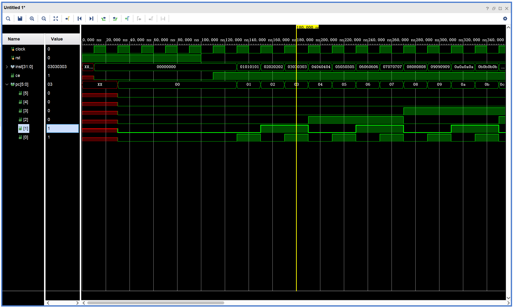

# Chapter2

这是《自己动手写CPU》第二章末尾的电路设计实践内容，也是全书的第一段Verilog代码实践。

## 设计内容
本工程实现的处理器取指令电路，包含两部分：PC模块、指令存储器。
- PC模块的功能是给出取指地址。
- 指令存储器ROM的作用是存储指令，并依据输入的地址，给出对应地址的指令。

## 设计文件
- inst_fetch.v：取指令模块顶层文件
- pc_reg.v：PC模块
- rom.v：指令存储器模块
- inst_fetch_tb.v：取指令模块测试文件
- rom.data：指令存储器数据文件

## 仿真波形

## 仿真结果分析
由图可知，每个时钟周期为20ns，每10ns时钟信号翻转一次。
初始时，复位值为高电平，使能信号为低电平，PC模块输出为0x00000000。
在100ns时刻，复位信号由高电平变为低电平，此时整个系统开始工作。到110ns时刻，此时时钟信号处于上升沿，使能信号由低电平变为高电平，PC模块开始工作。PC值从6'b000000开始，每隔一个时钟周期加1，即PC模块传给ROM模块的取指地址每次加1。
每隔一个时钟周期，ROM模块根据PC模块输出的地址值，输出对应的指令值。

## 实验要点
要使系统能取出指令，首先需要指令存储器ROM中有指令数据。那就要求在仿真前，需预先先将指令数据写入rom.data文件中，并在rom.v文件中指定rom.data文件的路径。
   **注意**：
   1. 这里的rom.data文件路径可以使用相对路径，也可以使用绝对路径，但使用绝对路径时，路径中要用双反斜杠“\\\\”表示路径分隔符，不能使用单反斜杠“\”，否则会报错找不到文件。
   2. rom.data文件的路径指示语句一定要放在定义好数据寄存器数组之后，否则会报错。