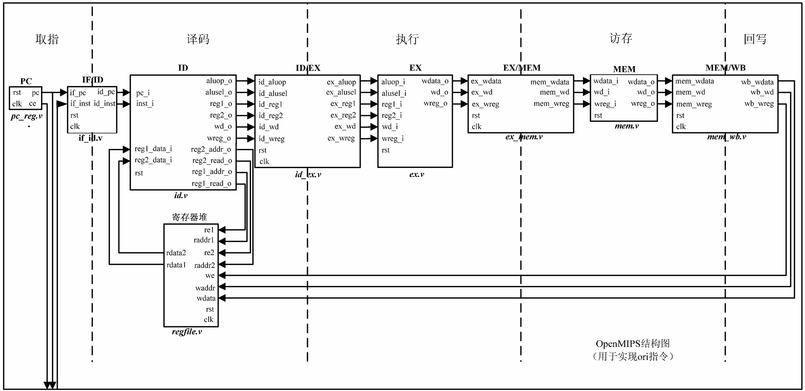
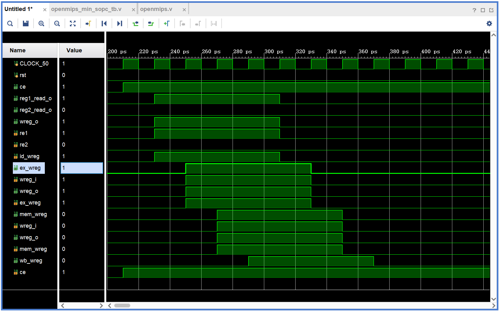

# Chapter4
这是第四章的内容。

## 设计内容
本工程实现的处理器的流水线设计，包含5个阶段：取指、译码、执行、访存、写回。
- 取指阶段的功能是从指令存储器中取出指令，指令存储器的地址由PC模块给出。
- 译码阶段的功能是对取出的指令进行译码，并读取寄存器堆中的数据。
- 执行阶段的功能是对译码阶段输出的数据进行运算。
- 访存阶段的功能是对执行阶段输出的数据进行访存。
- 写回阶段的功能是将访存阶段输出的数据写回寄存器堆。
流水线设计图如下：

## 设计文件
- defines.v：定义地址总线宽度、数据总线宽度、指令宽度和指令码等常量。
- pc_reg.v：PC模块, 用于给出取指地址。
- if_id.v：取指-译码阶段寄存器, 用于存储取指阶段输出的指令。
- regfile.v：寄存器堆模块, 用于存储处理器中的寄存器数据。
- id.v：译码阶段模块, 用于对取指阶段输出的指令进行译码。
- id_ex.v：译码-执行阶段寄存器, 用于存储译码阶段输出的数据。
- ex.v：执行阶段模块, 用于对译码阶段输出的数据进行运算。
- ex_mem.v：执行-访存阶段寄存器, 用于存储执行阶段输出的数据。
- mem.v：访存阶段模块, 用于对执行阶段输出的数据进行访存。
- mem_wb.v：访存-写回阶段寄存器, 用于存储访存阶段输出的数据。
- inst_rom.v：指令存储器模块, 用于存储处理器中的指令数据。
- openmips.v：处理器顶层模块, 用于连接其他模块。
- openmips_min_sopc.v：处理器最小系统SOPC模块, 用于连接其他模块。
- openmips_min_sopc_tb.v：处理器最小系统SOPC模块测试文件。
- inst_rom.S：汇编语言文件, 用于编写处理器中的指令。
- inst_rom.data：指令机器码文件，用于存储处理器中的指令机器码。

## 仿真波形

## 仿真结果分析
我懒得分析了，反正挺合理的。

## 实验要点
- 由于整个系统中的文件都使用了定义的宏常量，所以每个文件中都需要包含defines.v文件。
- 在建立mips编译环境时，由于是32位处理器，所以选用的虚拟机最好也要是32位的。Ubuntu 16.04 LTS 是Ubuntu的最后一个32位Linux发行版，所以mips-sde-elf-i686-pc-linux-gnu.tar.tar解压缩出来的交叉编译工具可以直接在该系统上编译运行。