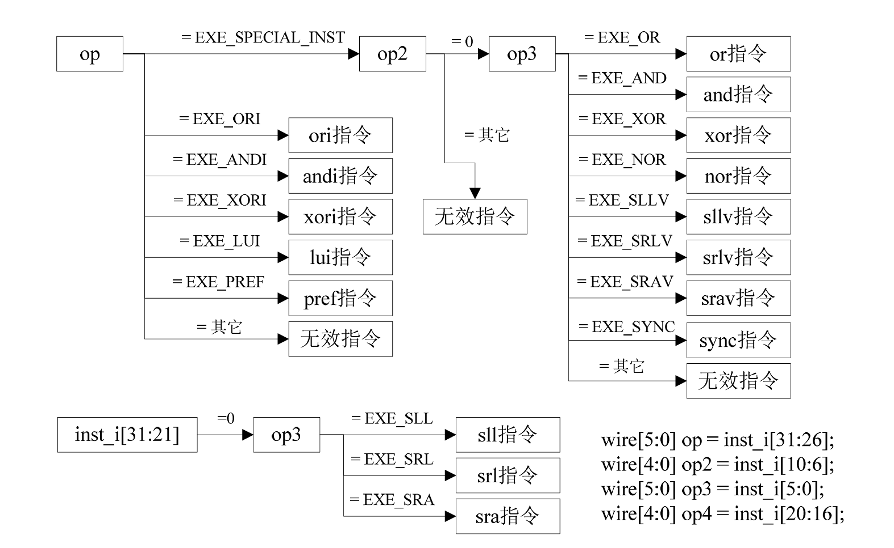
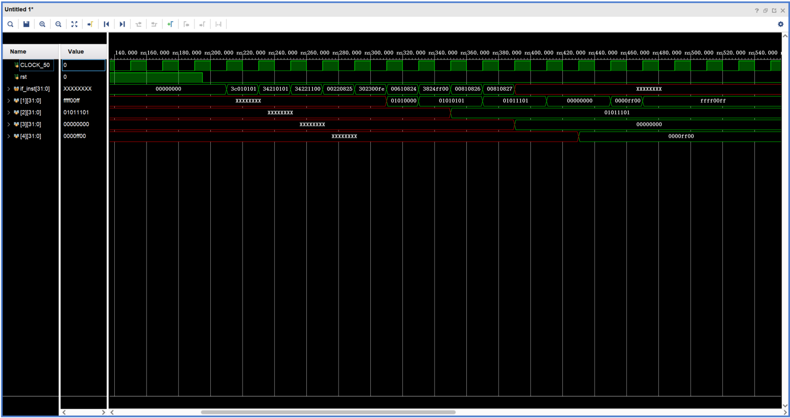

# Chapter5-2

这是第五章第二个实验的内容。

## 设计内容

本工程在实验chapter4实现流水线设计和chapter5-1解决流水线数据相关的基础上，扩展了一些逻辑操作指令、移位操作指令和空指令，包括：

- 逻辑操作指令：and、andi、or、ori、xor、xori、nor、lui
- 移位操作指令：sll、sllv、sra、srav、srl、srlv
- 空指令：nop（ssnop）、sync、pref

在译码阶段对指令的译码逻辑如下图

## 设计文件

- [defines.v](../src/defines.v)：定义地址总线宽度、数据总线宽度、指令宽度和指令码等常量。
- [pc_reg.v](../src/pc_reg.v)：PC模块, 用于给出取指地址。
- [if_id.v](../src/if_id.v)：取指-译码阶段寄存器, 用于存储取指阶段输出的指令。
- [regfile.v](../src/regfile.v)：寄存器堆模块, 用于存储处理器中的寄存器数据。
- [id.v](../src/id.v)：译码阶段模块, 用于对取指阶段输出的指令进行译码。
- [id_ex.v](../src/id_ex.v)：译码-执行阶段寄存器, 用于存储译码阶段输出的数据。
- [ex.v](../src/ex.v)：执行阶段模块, 用于对译码阶段输出的数据进行运算。
- [ex_mem.v](../src/ex_mem.v)：执行-访存阶段寄存器, 用于存储执行阶段输出的数据。
- [mem.v](../src/mem.v)：访存阶段模块, 用于对执行阶段输出的数据进行访存。
- [mem_wb.v](../src/mem_wb.v)：访存-写回阶段寄存器, 用于存储访存阶段输出的数据。
- [inst_rom.v](../src/inst_rom.v)：指令存储器模块, 用于存储处理器中的指令数据。
- [openmips.v](../src/openmips.v)：处理器顶层模块, 用于连接其他模块。
- [openmips_min_sopc.v](../src/openmips_min_sopc.v)：处理器最小系统SOPC模块, 用于连接其他模块。
- [openmips_min_sopc_tb.v](../sim/openmips_min_sopc_tb.v)：处理器最小系统SOPC模块测试文件。
- [inst_rom.S](../sim/inst_rom.S)：汇编语言文件, 用于编写处理器中的指令。
- [inst_rom.data](../sim/inst_rom.data)：指令机器码文件，用于存储处理器中的指令机器码。

## RTL级原理图

[chapter5-2实验的RTL级原理图](../sim/schematic.pdf)

## 仿真波形

以[inst_rom.S](../sim/inst_rom.S)汇编文件中的逻辑操作指令为例，仿真波形如下：

## 仿真结果分析

首先看汇编文件[inst_rom.S](../sim/inst_rom.S)，可以发现在这段汇编代码中，寄存器\$1、\$3、\$4只被写入一次，而寄存器\$1被多次写入。所以在仿真波形图中，寄存器\$2、\$3、\$4只会有一个值，而寄存器\$1会随着时钟周期的变换被写入多个不同的值。此外会发现，第一条指令会将数据加载到寄存器\$1中去，而在第二条指令中\$1又会作为参与运算的一个数据寄存器，如果是传统的不带有流水线的处理器中这当然是可以的，但是在流水线中这样子就会陷入数据相关的错误中，所以这里要搞清楚数据的来去。搞清楚问题后开始对仿真波形进行分析：

- 对仿真波形进行观察，会发现从第210ns开始，第一个指令即“lui \$1,0x0101”指令开始执行，这个指令会将立即数0x0101加载到寄存器\$1的高位中去。经过四个时钟周期即译码、执行、访存、写回阶段后，寄存器\$1中存储的数据为0x01010000，这符合lui指令的预期功能。
- 从第230ns开始，第二条指令“ori \$1,\$1,0x0101”开始执行，但他在译码阶段需要寄存器\$1中的数据0x01010000，可在这条指令译码阶段时上一条指令“lui \$1,0x0101”还处于执行阶段，还没有往寄存器\$1中写入数据，所以会发生数据相关的错误。为了解决这个问题，在实验[chapter5-1](../../chapter5-1)的代码中引入了数据前推技术，可以将指令“lui \$1,0x0101”在执行阶段的结果会直接写入到指令“ori \$1,\$1,0x0101”的译码阶段，所以这里实际运算就变成了0x01010000|0x00000101，结果为0x01010101。观察仿真波形，寄存器\$1的值确实是01010101，实际结果符合预期结果。
- 第三条指令“ori \$2,\$1,0x1100”不改变寄存器\$1的值，但计算时需要借助上一条指令“ori \$1,\$1,0x0101”的结果0x01010101，所以又用到了数据前推技术，具体流程参考上一条。最后实际结果符合预期结果0x01011101。
- 第四条指令“or \$1,\$1,\$2”会借助第三条指令“ori \$2,\$1,0x1100”和第二条指令“ori \$1,\$1,0x0101”的结果进行逻辑或运算。但当指令“or \$1,\$1,\$2”处于译码阶段时，指令“ori \$2,\$1,0x1100”还处于执行阶段，而指令“ori \$1,\$1,0x0101”也还处于访存阶段。所以这里运用数据前推技术，直接将寄存器第二条指令访存阶段的结果和第三条指令执行阶段的结果前推到指令“or \$1,\$1,\$2”的译码阶段，实际运算就变为0x01010101|0x01011101,结果为0x01011101。观察仿真波形，寄存器\$1的值确实变为01011101，实际结果符合预期结果。
- 后续指令的数据前推分析方法同上。只需仔细分析指令的执行过程，就可以很容易地理解数据前推的原理。

## 实验要点

没有要点。只是说，在这里应该好好读仿真时序图，理解指令的执行过程。
